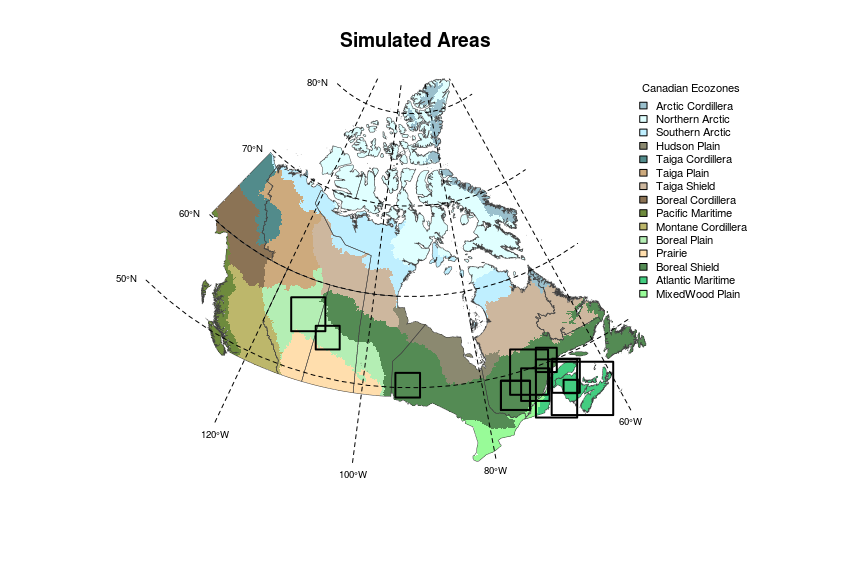

# Initial Aboveground Biomass - k-NN Estimations
Dominic cyr  
Updated on Jan 31 2018

This document presents summary statistics of initial tree aboveground biomass as estimated by [Beaudoin et al (2014)][1] for several areas where LANDIS-II simulation experiments have been conducted.

The following summary statistics are computed for what are considered 'active' forest pixels in our simulations, i.e. those that are made of at least 50% of productive forest at a 250-m resolution.

The methodology and known biases associated with the following results are described in [Beaudoin et al][1]'s paper.





###Initial Biomass - K-Nearest Neighbourg Estimations
####Summary statistics - Total aboveground biomass


```
##          code                   name LANDIS-II
## 1     Acadian                Acadian available
## 10      ALPAC                  ALPAC available
## 2          AM      Atlantic Maritime available
## 3          BP           Boreal Plain available
## 4         BSE  Eastern Boreal Shield available
## 7      BSEmod      BSE (Boreal only) available
## 5         BSW  Western Boreal Shield available
## 6         LSJ         Lac Saint-Jean available
## 9  NorthShore            North Shore available
## 12  QcCentral         Central Quebec available
## 11       QcNb Quebec - New Brunswick available
## 8      SudStl      Sud Saint-Laurent available
```

```
##            SimulationArea meanAGBiomass_TonsPerHa maxAGBiomass_TonsPerHa
## 1                 Acadian                    63.8                  288.8
## 2                   ALPAC                    56.6                  306.7
## 3       Atlantic Maritime                    70.1                  284.0
## 4            Boreal Plain                    61.2                  256.2
## 5   Eastern Boreal Shield                    68.0                  276.2
## 6   Western Boreal Shield                    77.4                  264.8
## 7          Lac Saint-Jean                    49.6                  316.3
## 8             North Shore                    59.7                  187.0
## 9          Central Quebec                    52.5                  260.1
## 10 Quebec - New Brunswick                    69.8                  288.8
## 11      Sud Saint-Laurent                    68.3                  277.3
##    quantile0.05 quantile0.25 quantile0.5 quantile0.75 quantile0.95
## 1          20.5         44.0        62.8         82.3        109.6
## 2          12.5         29.6        50.4         80.0        117.4
## 3          26.6         48.7        67.8         90.6        118.2
## 4           7.9         36.1        59.2         85.2        117.5
## 5          11.6         49.1        70.1         88.3        118.1
## 6          31.2         59.1        78.9         96.3        119.2
## 7           6.3         26.6        52.9         70.9         87.7
## 8          10.3         43.2        65.2         79.8         91.9
## 9          11.1         35.1        53.1         70.1         91.4
## 10         23.5         49.5        70.3         88.3        117.5
## 11         24.4         49.5        68.0         85.5        114.7
```

Individual species' initial biomass can be found in the following '.csv' tables:

1. Acadian ([Display][2]/[Download][3])
2. ALPAC ([Display][4]/[Download][5])
3. Atlantic Maritime ([Display][6]/[Download][7])
4. Boreal Plain ([Display][8]/[Download][9])
5. Eastern Boreal Shield ([Display][10]/[Download][11])
6. Western Boreal Shield ([Display][12]/[Download][13])
7. Lac Saint-Jean ([Display][14]/[Download][15])
8. North Shore ([Display][16]/[Download][17])
9. Central Quebec ([Display][18]/[Download][19])
10. Quebec - New Brunswick ([Display][20]/[Download][21])
11. Sud Saint-Laurent ([Display][22]/[Download][23])


[1]: http://www.nrcresearchpress.com/doi/abs/10.1139/cjfr-2013-0401

[2]: https://github.com/dcyr/InitialBiomass/blob/master/summaryStats/initBiomassSummaryStats_Acadian.csv
[4]: https://github.com/dcyr/InitialBiomass/blob/master/summaryStats/initBiomassSummaryStats_ALPAC.csv
[6]: https://github.com/dcyr/InitialBiomass/blob/master/summaryStats/initBiomassSummaryStats_AM.csv
[8]: https://github.com/dcyr/InitialBiomass/blob/master/summaryStats/initBiomassSummaryStats_BP.csv
[10]: https://github.com/dcyr/InitialBiomass/blob/master/summaryStats/initBiomassSummaryStats_BSE.csv
[12]: https://github.com/dcyr/InitialBiomass/blob/master/summaryStats/initBiomassSummaryStats_BSW.csv
[14]: https://github.com/dcyr/InitialBiomass/blob/master/summaryStats/initBiomassSummaryStats_LSJ.csv
[16]: https://github.com/dcyr/InitialBiomass/blob/master/summaryStats/initBiomassSummaryStats_NorthShore.csv
[18]: https://github.com/dcyr/InitialBiomass/blob/master/summaryStats/initBiomassSummaryStats_QcCentral.csv
[20]: https://github.com/dcyr/InitialBiomass/blob/master/summaryStats/initBiomassSummaryStats_QcNb.csv
[22]: https://github.com/dcyr/InitialBiomass/blob/master/summaryStats/initBiomassSummaryStats_SudStl.csv

[3]: https://raw.githubusercontent.com/dcyr/InitialBiomass/master/summaryStats/initBiomassSummaryStats_Acadian.csv
[5]: https://raw.githubusercontent.com/dcyr/InitialBiomass/master/summaryStats/initBiomassSummaryStats_ALPAC.csv
[7]: https://raw.githubusercontent.com/dcyr/InitialBiomass/master/summaryStats/initBiomassSummaryStats_AM.csv
[9]: https://raw.githubusercontent.com/dcyr/InitialBiomass/master/summaryStats/initBiomassSummaryStats_BP.csv
[11]: https://raw.githubusercontent.com/dcyr/InitialBiomass/master/summaryStats/initBiomassSummaryStats_BSE.csv
[13]: https://raw.githubusercontent.com/dcyr/InitialBiomass/master/summaryStats/initBiomassSummaryStats_BSW.csv
[15]: https://raw.githubusercontent.com/dcyr/InitialBiomass/master/summaryStats/initBiomassSummaryStats_LSJ.csv
[17]: https://raw.githubusercontent.com/dcyr/InitialBiomass/master/summaryStats/initBiomassSummaryStats_NorthShore.csv
[19]: https://raw.githubusercontent.com/dcyr/InitialBiomass/master/summaryStats/initBiomassSummaryStats_QcCentral.csv
[21]: https://raw.githubusercontent.com/dcyr/InitialBiomass/master/summaryStats/initBiomassSummaryStats_QcNb.csv
[23]: https://raw.githubusercontent.com/dcyr/InitialBiomass/master/summaryStats/initBiomassSummaryStats_SudStl.csv
